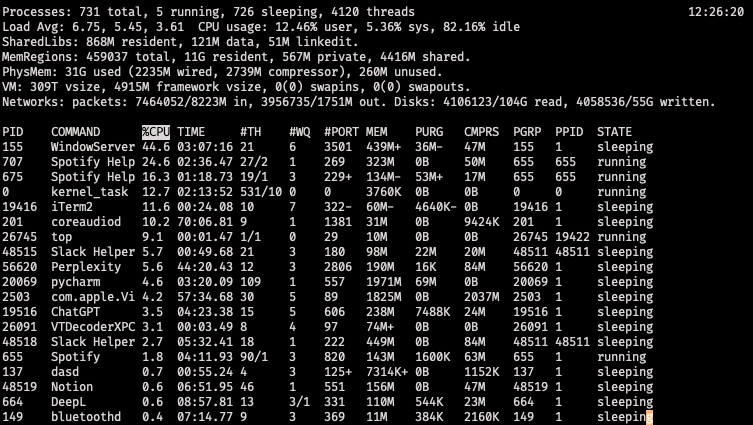

# 프로젝트 설명

# 리눅스 명령어 조사

## top

`top` 명령어는 현재 시스템에서 실행 중인 프로세스와 시스템의 리소스 사용 현황을 실시간으로 보여주는 명령어입니다.

### 주요 기능

- CPU, 메모리 사용량 확인
- 실행 중인 프로세스 목록 확인
- 시스템 부하 상태 확인
- 실시간 모니터링

### 기본 사용법

```bash
top
```

### 사용 예시



위 사진은 제 개인 맥북에서 top을 실행했을 때의 모습입니다.

해당 화면에서 각각의 속성은 다음과 같은 의미들을 나타냅니다.

| 필드        | 설명                                           |
|-----------|----------------------------------------------|
| `PID`     | 프로세스 ID                                      |
| `COMMAND` | 실행 중인 명령어 또는 프로세스 이름                         |
| `%CPU`    | CPU 사용률 (%)                                  |
| `TIME`    | 프로세스가 사용한 CPU 시간의 총합 (누적 시간)                 |
| `#TH`     | 프로세스에 속한 스레드 수                               |
| `#WQ`     | Workqueue 수 (I/O 작업 대기열 등, macOS 특화 항목)      |
| `#PORT`   | 열린 포트 수 (IPC, 네트워크 소켓 등)                     |
| `MEM`     | 실제 물리 메모리 사용량                                |
| `PURG`    | Purgeable Memory (다른 프로세스가 필요하면 제거 가능한 메모리)  |
| `CMPRS`   | 압축된 메모리                                      |
| `PGRP`    | 프로세스 그룹 ID (Process Group ID)                |
| `PPID`    | 부모 프로세스 ID (Parent Process ID)               |
| `STATE`   | 현재 상태 (예: `running`, `sleeping`, `zombie` 등) |

### 주요 옵션

| 옵션          | 설명                                           |
|-------------|----------------------------------------------|
| `-d <초>`    | 화면 갱신 주기 설정 (기본 3초). 예: `top -d 1` → 1초마다 갱신 |
| `-p <PID>`  | 특정 프로세스(PID)만 모니터링                           |
| `-n <반복횟수>` | 지정한 횟수만큼 화면 갱신 후 종료. 예: `top -n 5`           |
| `-b`        | 배치 모드로 실행. 텍스트 파일 저장용 또는 스크립트에 사용 가능         |
| `-u <사용자>`  | 특정 사용자의 프로세스만 표시                             |
| `-U <사용자>`  | 특정 실사용자(real user)의 프로세스만 표시                 |
| `-c`        | 프로세스 명령어 전체 경로 표시                            |
| `-H`        | 스레드 단위로 출력                                   |
| `-i`        | 유휴 프로세스 숨김                                   |
| `-s`        | 보안 모드 활성화                                    |
| `-v`        | 버전 정보 출력                                     |

## ps

## job

## kill