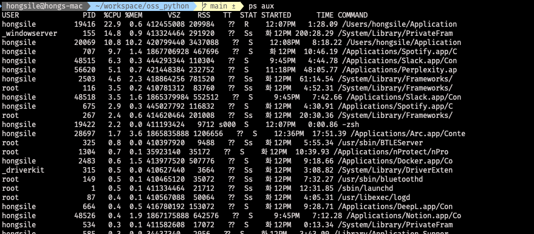

# 프로젝트 설명

# 리눅스 명령어 조사

## top

`top` 명령어는 현재 시스템에서 실행 중인 프로세스와 시스템의 리소스 사용 현황을 실시간으로 보여주는 명령어입니다.

### 주요 기능

- CPU, 메모리 사용량 확인
- 실행 중인 프로세스 목록 확인
- 시스템 부하 상태 확인
- 실시간 모니터링

### 기본 사용법

```bash
top
```

### 사용 예시


위 사진은 제 개인 맥북에서 top을 실행했을 때의 모습입니다.

해당 화면에서 각각의 속성은 다음과 같은 의미들을 나타냅니다.

| 필드        | 설명                                           |
|-----------|----------------------------------------------|
| `PID`     | 프로세스 ID                                      |
| `COMMAND` | 실행 중인 명령어 또는 프로세스 이름                         |
| `%CPU`    | CPU 사용률 (%)                                  |
| `TIME`    | 프로세스가 사용한 CPU 시간의 총합 (누적 시간)                 |
| `#TH`     | 프로세스에 속한 스레드 수                               |
| `#WQ`     | Workqueue 수 (I/O 작업 대기열 등, macOS 특화 항목)      |
| `#PORT`   | 열린 포트 수 (IPC, 네트워크 소켓 등)                     |
| `MEM`     | 실제 물리 메모리 사용량                                |
| `PURG`    | Purgeable Memory (다른 프로세스가 필요하면 제거 가능한 메모리)  |
| `CMPRS`   | 압축된 메모리                                      |
| `PGRP`    | 프로세스 그룹 ID (Process Group ID)                |
| `PPID`    | 부모 프로세스 ID (Parent Process ID)               |
| `STATE`   | 현재 상태 (예: `running`, `sleeping`, `zombie` 등) |

### 주요 옵션

| 옵션          | 설명                                           |
|-------------|----------------------------------------------|
| `-d <초>`    | 화면 갱신 주기 설정 (기본 3초). 예: `top -d 1` → 1초마다 갱신 |
| `-p <PID>`  | 특정 프로세스(PID)만 모니터링                           |
| `-n <반복횟수>` | 지정한 횟수만큼 화면 갱신 후 종료. 예: `top -n 5`           |
| `-b`        | 배치 모드로 실행. 텍스트 파일 저장용 또는 스크립트에 사용 가능         |
| `-u <사용자>`  | 특정 사용자의 프로세스만 표시                             |
| `-U <사용자>`  | 특정 실사용자(real user)의 프로세스만 표시                 |
| `-c`        | 프로세스 명령어 전체 경로 표시                            |
| `-H`        | 스레드 단위로 출력                                   |
| `-i`        | 유휴 프로세스 숨김                                   |
| `-s`        | 보안 모드 활성화                                    |
| `-v`        | 버전 정보 출력                                     |

## ps

`ps` 명령어는 현재 실행 중인 프로세스의 상태를 스냅샷 형태로 출력합니다.

`top`과 달리 실시간으로 변동되는 정보가 아닌, 명령어 실행 시점의 프로세스 상태를 보여줍니다.

### 주요 기능

- 현재 실행 중인 프로세스 확인
- 특정 사용자, 특정 조건의 프로세스 조회
- 프로세스 상태, PID, 메모리, CPU 등 정보 확인
- 다른 명령어와 파이프라인으로 활용 가능

### 기본 사용법

```bash
ps
```

### 사용 예시

```bash
ps aux
```

이 명령어는 시스템의 모든 프로세스를 전체 포맷으로 출력합니다.



### 주요 필드 설명

| 필드        | 설명                                |
|-----------|-----------------------------------|
| `USER`    | 프로세스를 실행한 사용자                     |
| `PID`     | 프로세스 ID                           |
| `%CPU`    | CPU 사용률                           |
| `%MEM`    | 메모리 사용률                           |
| `VSZ`     | 가상 메모리 사용량(KB)                    |
| `RSS`     | 실제 메모리 사용량(Resident Set Size, KB) |
| `TT`      | 터미널 종류 (없으면 `?`)                  |
| `STAT`    | 프로세스 상태                           |
| `START`   | 프로세스가 시작된 시간                      |
| `TIME`    | 프로세스가 사용한 CPU 시간의 총합              |
| `COMMAND` | 실행된 명령어 전체                        |

### STAT 상태 코드

| 코드  | 설명      |
|-----|---------|
| `R` | 실행 중    |
| `S` | 대기 상태   |
| `D` | 디스크 대기  |
| `Z` | 좀비 프로세스 |
| `T` | 일시 정지   |
| `I` | 유휴 상태   |

### 주요 옵션

| 옵션             | 설명                                          |
|----------------|---------------------------------------------|
| `-e` 또는 `-A`   | 모든 사용자 프로세스 표시                              |
| `-f`           | 풀 포맷으로 상세 정보 표시                             |
| `-u <사용자>`     | 특정 사용자의 프로세스만 표시                            |
| `-x`           | 터미널에 종속되지 않은 프로세스도 표시                       |
| `-o <format>`  | 원하는 필드만 선택하여 출력                             |
| `-p <PID>`     | 특정 PID에 대한 정보만 출력                           |
| `-C <command>` | 특정 명령어를 실행 중인 프로세스만 표시                      |
| `aux`          | BSD 스타일. a(다른 사용자 포함), u(사용자 중심), x(터미널 무관) |

### 자주 사용하는 명령어 조합

- 현재 시스템의 모든 프로세스 확인:

```bash
ps aux
```

- 현재 로그인한 사용자 프로세스만 보기:

```bash
ps u
```

- 특정 프로세스 PID로 조회:

```bash
ps -p 1234
```

- 명령어 이름으로 프로세스 찾기:

```bash
ps -C nginx
```

- 원하는 항목만 출력:

```bash
ps -eo pid,comm,%cpu,%mem
```

## job

`jobs` 명령어는 현재 쉘에서 백그라운드로 실행 중인 작업 목록을 확인할 때 사용하는 명령어입니다. 터미널 세션에서 실행한 작업들에 대한 상태를 보여줍니다.

### 주요 기능

- 백그라운드 작업 목록 확인
- 현재 터미널 세션에서 실행 중인 작업 상태 조회
- 작업 번호(Job ID)를 통해 작업 제어 가능

### 기본 사용법

```bash
jobs
```

### 사용 예시

```bash
sleep 100 &
jobs
```

이 명령어는 `sleep 100`을 백그라운드로 실행한 뒤 현재 실행 중인 작업을 보여줍니다.


### 주요 필드 설명

| 필드         | 설명                                       |
|------------|------------------------------------------|
| `[n]`      | 작업 번호(Job ID). `n`은 작업 번호                |
| `+` 또는 `-` | 현재 또는 직전 작업을 나타냄. `+`는 기본 작업, `-`는 이전 작업 |
| `상태`       | 작업의 현재 상태 (Running, Stopped 등)           |
| `명령어`      | 실행 중인 명령어 전체                             |

### 상태(Status) 코드

| 상태        | 설명                          |
|-----------|-----------------------------|
| `Running` | 작업이 실행 중                    |
| `Stopped` | 일시 중지 상태 (Ctrl + Z 등으로 중단됨) |
| `Done`    | 작업이 완료됨                     |

### 주요 옵션

| 옵션   | 설명                |
|------|-------------------|
| `-l` | 작업 번호와 PID를 함께 표시 |
| `-p` | PID만 표시           |
| `-n` | 최근 상태가 변경된 작업만 표시 |

### 자주 사용하는 명령어 조합

- 현재 터미널에서 실행 중인 작업 보기:

```bash
jobs
```

- PID 포함하여 작업 상태 보기:

```bash
jobs -l
```

- PID만 출력:

```bash
jobs -p
```

- 최근 상태가 바뀐 작업만 보기:

```bash
jobs -n
```

## kill

`kill` 명령어는 프로세스에 시그널을 보내어 특정 동작을 하게 만드는 명령어입니다. 

주로 프로세스를 종료할 때 사용되지만, 단순히 종료뿐만 아니라 일시 정지, 재개, 사용자 정의 시그널도 전달할 수
있습니다.

### 주요 기능

- 프로세스 종료
- 프로세스 일시 중지 및 재개
- 사용자 정의 시그널 전달

### 기본 사용법

```bash
kill <PID>
```

기본적으로 `SIGTERM(15)` 시그널을 보내며, 이는 정상 종료 요청입니다.

### 사용 예시

```bash
kill 1234
```

PID가 1234인 프로세스에 종료 시그널을 보냅니다.

### 주요 옵션

| 옵션            | 설명                                      |
|---------------|-----------------------------------------|
| `-l`          | 사용 가능한 시그널 목록 출력                        |
| `-s <signal>` | 보낼 시그널을 이름 또는 번호로 지정                    |
| `-<signal>`   | 간략한 시그널 전달. 예: `kill -9 1234` (SIGKILL) |

### 자주 사용하는 시그널

| 시그널 번호     | 시그널 이름  | 설명                               |
|------------|---------|----------------------------------|
| `1`        | SIGHUP  | 터미널 종료, 설정 재로드 요청 (서비스 재시작 시 활용) |
| `2`        | SIGINT  | 인터럽트 (Ctrl + C와 동일)              |
| `9`        | SIGKILL | 강제 종료 (무조건 종료, 취소 불가)            |
| `15`       | SIGTERM | 정상 종료 요청 (기본값)                   |
| `18/19/20` | SIGCONT | 일시 중지된 프로세스 재개                   |
| `17/19/23` | SIGSTOP | 일시 중지 (Ctrl + Z와 유사)             |

> 시그널 번호는 운영체제에 따라 약간 다를 수 있음.

### 주요 필드 설명

| 항목       | 설명                         |
|----------|----------------------------|
| `PID`    | 시그널을 보낼 대상 프로세스의 ID        |
| `Signal` | 전달할 시그널 (숫자 또는 이름으로 지정 가능) |

### 자주 사용하는 명령어 조합

- 일반적인 종료 요청:

```bash
kill <PID>
```

- 강제 종료:

```bash
kill -9 <PID>
```

- 시그널 목록 확인:

```bash
kill -l
```

- 특정 시그널을 이름으로 전달:

```bash
kill -SIGSTOP <PID>   # 일시 정지
kill -SIGCONT <PID>   # 다시 실행
```

- jobs 명령어와 함께 백그라운드 작업 종료:

```bash
kill %1
```